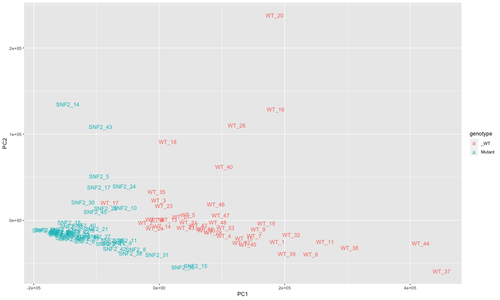
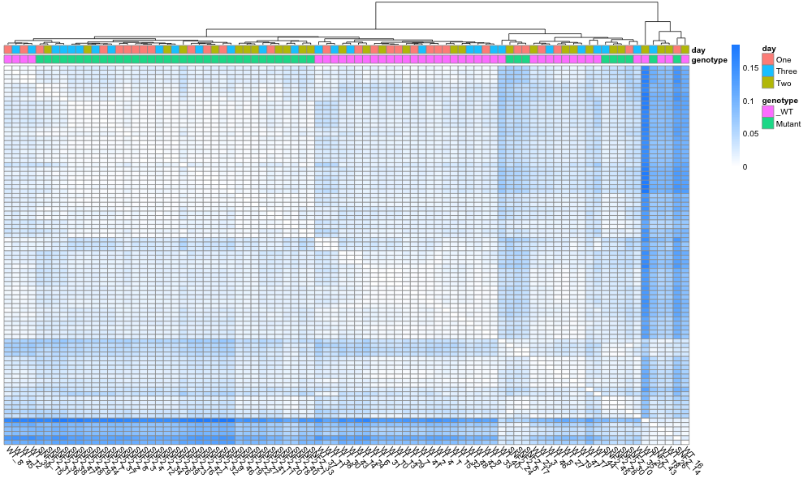
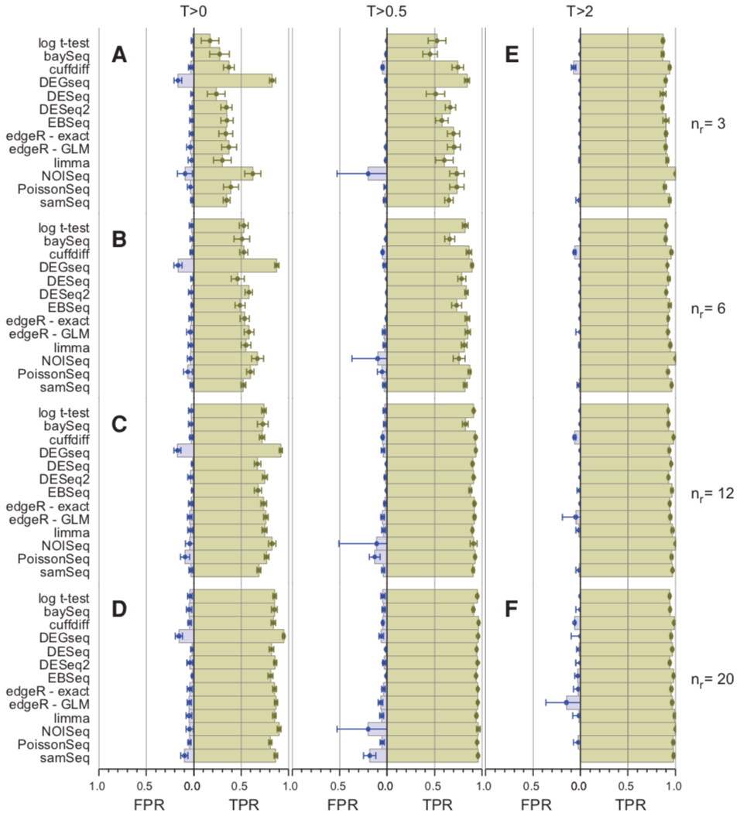
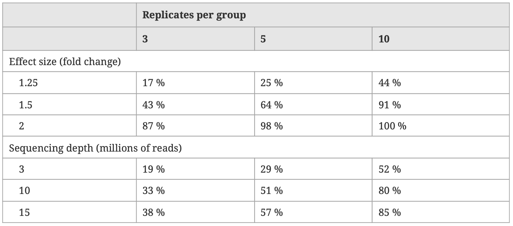
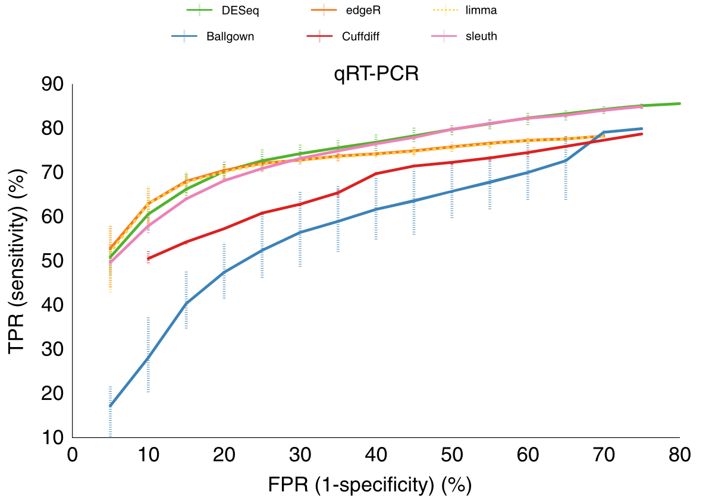

<style type="text/css">
body{ font-size: 170%; }
</style>

```{r setup, include=FALSE}
knitr::opts_chunk$set(echo = TRUE, comment = NA)
library(tidyverse)
library(shiny)
library(DT)
library(learnr)
library(MASS)
library(sleuth)
```

| [Day 1: Concepts](../day1/day1.Rmd) | [Day 2: Sleuth tutorial](../day2/day2.Rmd) | [Day 3: RNA-Seq analysis](./day3.Rmd) |
|-------------------------------------|--------------------------------------------|---------------------------------------|

## Introduction

Today we will go through what we did yesterday with Sleuth and explain how each step works. We'll also cover some additional topics:

* how can we quality control our samples?
* how can we make sure our experiments have power to detect the effects we're looking for?
* how do we handle alternative transcripts in Sleuth?
* what other tools are available for RNA-seq analysis?

We will go into some detail about how differential expression tools work, not all of which is strictly necessary to understand your results. Feel free to skip the sections marked Optional if they don't interest you or if you are short of time. But if a section is not marked Optional, please read it!

Before we start, reload your Sleuth analysis from yesterday so we can look at the results as we go through, and open up the Sleuth web interface:

```{r, eval=FALSE}
library(sleuth)
so <- sleuth_load("yeast_sleuth_analysis.rds")
sleuth_live(so)
```

If you didn't finish the analysis, look at this [Google Drive folder](https://drive.google.com/drive/u/1/folders/1GtgZ967s1BOm-DpXPG_XXfsNqxZpbZDN). You should see a set of `rds` files with names like this:

`yeast_subsample_3_1.rds`

Each `rds` file is a Sleuth analysis of a random subset of yeast samples. Each number of replicates (3, 6, 9, 12) has five random samples, 1-5. The first number in the filename is the number of replicates sampled, the second is the random sample number.

1. Pick *one* of the 5 samples for the number of replicates you were working with yesterday and download that file. To download, click on the file, then the '3 vertical dots' icon in the top right, then select 'Download'.

2. Move the file into your project folder.

3. Load the file into Sleuth like this (replacing the filename with whatever the name of your file is):

```{r, eval=FALSE}
library(sleuth)
so <- sleuth_load("yeast_subsample_3_1.rds")
sleuth_live(so)
```

You can now use this data set for the rest of this morning.

## Loading data

We're going to pick apart the R commands we ran yesterday so you can understand what's happening. In the process, we'll explore some other aspects of RNA-Seq we haven't covered yet. For example, here's how we loaded in the data file:

```{r, eval=FALSE}
samples<-read.table("yeast_samples_subset.tsv", sep="\t", header=TRUE, stringsAsFactors=FALSE)
```

Recall the file looked something like this:
```
sample	genotype	day	path
SNF2_1	Mutant	One	SNF2_1
SNF2_2	Mutant	One	SNF2_2
SNF2_3	Mutant	One	SNF2_3
SNF2_4	Mutant	One	SNF2_4
SNF2_5	Mutant	One	SNF2_5
...
WT_1	_WT	One	WT_1
WT_2	_WT	One	WT_2
WT_3	_WT	One	WT_3
WT_4	_WT	One	WT_4
WT_5	_WT	One	WT_5
```

The `read.table` function loads a table of data from a file. The columns in our table are separated by tab characters, so we pass `read.table` the `sep="\t"` argument, where `\t` is a shorthand for the tab character. There is a header row in our table giving the names of the columns; we tell `read.table` about this with `header=TRUE`.

Finally, by default R converts any string variables (variables containing text, rather than, say, numbers) into a special data type called factors. A factor is R's way of representing categorical variables, such as our `genotype` or `day` columns, so that they can be used in statistical models. However, our `sample` and `path` columns are not categorical variables like this, so we tell R not to convert strings to factors with `stringsAsFactors=FALSE`. (Sleuth will take care of interpreting `genotype` and `day` properly later.)

R quite often does things silently (converting strings to factors, for example) that it thinks will help us, but can end up being quite confusing. For example, R will usually sort variable conditions alphabetically, and many modelling packages (including Sleuth) will use the first condition in the list as the control condition. But that won't work for our treatment variable, with conditions **Mutant** and **WT**; that would make **Mutant** the control condition.

This is why our wild type condition is `_WT`, not just `WT`; the `_` ensures that this condition is sorted first. This is just a hack to get around R's behaviour, but it's not too bad; it allows us to see easily what the control conditions are just by reading our sample table and looking for `_`.

Feel free to reload the samples into R omitting one or more of the arguments to `read.table` and see what happens.


## Negative binomial distributions

The next steps were to load our data into Sleuth, and fit some models:

```{r, eval=FALSE}
so <- sleuth_prep(samples, read_bootstrap_tpm=TRUE)
so <- sleuth_fit(so, ~genotype+day, "full")
so <- sleuth_fit(so, ~day, "reduced")
```

We'll come back to the `read_bootstrap_tpm` argument later (in the "TPMs" and "Types of variance" sections). Here, we'll start to explore what it means to fit a model.

We saw on Day 1 how we could estimate the effect of a treatment by fitting data from different conditions to distributions, and then comparing those distributions. We used the normal distribution then, but the normal distribution does not fit RNA-seq data well. Our raw data are read counts, which are discrete and cannot be below 0, whereas the normal distribution is continuous and can fit negative values.

Count data is typically fit with a [Poisson distribution](https://en.wikipedia.org/wiki/Poisson_distribution), which measures how many times an event occurs in some period. In our case, we measure the number of reads sequenced from some transcript during the sequencing run. The Poisson distribution has a single parameter, $\lambda$ (lambda), which is the average number of events in the period. 

$\lambda$ is both the mean and the variance of the Poisson distribution. However, this has turned out not to be a good fit for RNA-seq data, because transcript counts tend to vary widely. Therefore, to fit RNA-seq data, we use the [*negative binomial* distribution](https://en.wikipedia.org/wiki/Negative_binomial_distribution), which has both a mean and a size parameter. This is similar to the mean and standard deviation parameters for the normal distribution; the mean measures the location of the distribution, the size parameter relates to the spread of data around the mean.

For evidence that the negative binomial distribution is a good fit for RNA-seq data, see [Gierlinski et al. 2015](https://academic.oup.com/bioinformatics/article-abstract/31/22/3625/240923), which measures the variance in the yeast data we're using here.

Here is a negative binomial distribution:
```{r, echo=FALSE}
fixedRow(
  column(6, 
    sliderInput("nb_mu", label = "Mean:",
                min = 1, max = 100, value = 20, step = 1),
    sliderInput("nb_size", label = "Size:",
                min = 1, max = 100, value = 10, step = 1)
  ),
  column(6, 
    sliderInput("nb_replicates", label= "Replicates:",
                min = 1, max = 200, value = 100, step = 1),
    actionButton("nb_resample", "Resample")
  )
)
fixedRow(
  column(12,
    plotOutput("drawNBPlot")
  )
)
```

```{r drawing from negative binomial distribution, context="server"}
nb_sample<-reactive({
  input$nb_resample
  data.frame(x=rnbinom(input$nb_replicates, mu=input$nb_mu, size=input$nb_size))
})

x_max<-reactive(input$nb_mu * 3)

nb_curve<-reactive({
  vals <- 0:x_max()
  data.frame(x=vals, y=dnbinom(vals, mu=input$nb_mu, size=input$nb_size) * input$nb_replicates)
})


output$drawNBPlot<-renderPlot({
  ggplot(nb_sample(), aes(x)) + geom_histogram(binwidth=1) + geom_point(aes(x, y), data=nb_curve(), colour="grey") + theme_bw() + xlim(NA, x_max())
})
```

The dots show the actual probability distribution, scaled to the number of replicates requested; the histogram shows a sample taken from this distribution. Note that we use dots and bars here, rather than lines, because the distribution can only take integer values for x. We also have discrete counts on the y axis. Try resampling the data a few times; you will see that this discreteness means the histogram only captures the rough shape of the curve, even with a large number of replicates.

1. You can see that the curve is quite like the normal distribution, but has a long tail to the right. Try increasing the size and/or mean parameters. As they increase, the curve becomes more like the normal distribution.

2. Now try reducing the size parameter, and try all values of size from 1 to 10. The distribution gets more and more skewed as the parameters approach zero.

Think about what the Poisson and negative binomial distribution are intended to measure (see above). Do these distributions with small size values make sense?

## Optional: Log normal distributions

Many papers such as [Gierlinski et al. 2015](https://academic.oup.com/bioinformatics/article-abstract/31/22/3625/240923) have shown that the negative binomial distribution is a good fit for RNA-seq data, and many tools fit models using it (such as [DESeq2](https://www.bioconductor.org/packages/release/bioc/html/DESeq2.html) or [edgeR](https://bioconductor.org/packages/release/bioc/html/edgeR.html)). However, because the negative binomial distribution is nowhere near as common as the normal distribution, there are far fewer tools and modelling methods available for it.

Therefore, in order to use normal distribution techniques, some tools (including Sleuth) choose to convert RNA-Seq data into a distribution that approximates the normal distribution.

For example, the [limma](https://bioconductor.org/packages/release/bioc/html/limma.html) package was developed for analysing microarrays, which do produce normally distributed data. The [Smyth lab](https://www.wehi.edu.au/people/gordon-smyth), who developed limma, also developed [edgeR](https://bioconductor.org/packages/release/bioc/html/edgeR.html), which models RNA-Seq data with a negative binomial model. But they have also developed [voom](https://academic.oup.com/nar/article/43/7/e47/2414268), which converts RNA-seq data into a normal form suitable for limma, and so allows us to apply years of knowledge developed for microarrays to RNA-Seq data.

How can we approximate a normal distribution from negative binomially distributed data? We can take logarithms of our abundance values, which makes them roughly normal. The plots below shows the same negative binomial plot as before on the left, and a log normal conversion on the right:

```{r, echo=FALSE}
fixedRow(
  column(6, 
    sliderInput("nblog_mu", label = "Mean:",
                min = 1, max = 100, value = 20, step = 1),
    sliderInput("nblog_size", label = "Size:",
                min = 1, max = 100, value = 10, step = 1)
  ),
  column(6, 
    sliderInput("nblog_replicates", label= "Replicates:",
                min = 1, max = 200, value = 100, step = 1),
    actionButton("nblog_resample", "Resample")
  )
)
fixedRow(
  column(6,
    plotOutput("drawNBLogPlot")
  ),
  column(6,
    plotOutput("drawLogNormPlot")
  )
)
```

```{r negative binomial to log normal, context="server"}
nblog_sample<-reactive({
  input$nblog_resample
  data.frame(x=rnbinom(input$nblog_replicates, mu=input$nblog_mu, size=input$nblog_size))
})

nblog_curve<-reactive({
  vals <- 0:nblog_x_max()
  data.frame(x=vals, y=dnbinom(vals, mu=input$nblog_mu, size=input$nblog_size) * input$nblog_replicates)
})

nblog_x_max<-reactive(input$nblog_mu * 3)

nblog_log_sample <- reactive(nblog_sample() %>% mutate(logx=log(x+0.5)))
nblog_log_curve <- reactive(nblog_curve() %>% mutate(logx=log(x+0.5)))

output$drawNBLogPlot<-renderPlot({
  ggplot(nblog_sample(), aes(x)) + geom_histogram(binwidth=1) + geom_point(aes(x, y), data=nblog_curve(), colour="grey") + theme_bw() + xlim(NA, nblog_x_max())
})

output$drawLogNormPlot<-renderPlot({
  ggplot(nblog_log_sample()) + geom_bar(aes(logx)) + geom_line(aes(logx, y), data=nblog_log_curve(), colour="grey", size=2) + theme_bw() + xlim(NA, log(nblog_x_max())) + xlab("log(x+0.5)")
})
```

Note that while the log conversion does reduce the long positive tail that the negative binomial distribution usually has, it can produce a skew to the left, especially at low mean and size values. It is not a perfect transformation to the normal by any means, but it has proven to be close enough in practice for most genes.

Also note that the usual log transformation here uses *natural* logarithms, not the binary logs (base 2) we used on Day 1. A natural logarithm is to the base $e$, where $e$ is the [mathematical constant 2.71828...](https://en.wikipedia.org/wiki/E_(mathematical_constant)). Remember logs can be taken to any base, and $e$ has some nice properties that make it convenient to work with (though we won't go into them here). Finally, we calculate `log(x+0.5)`, not `log(x)`, because `log(0)` is negative infinity; adding a small positive value ensures we always have reasonable log values.

We'll continue to use negative binomial distributions, because they're a bit easier to connect with the underlying read counts, and they are used in many RNA-seq tools. But bear in mind that other tools including sleuth may use log normal distributions instead.


## Modelling multiple variables

```{r, eval=FALSE}
so <- sleuth_fit(so, ~genotype+day, "full")
so <- sleuth_fit(so, ~day, "reduced")
```

So what does `sleuth_fit` do, besides fitting our data to distributions? Remember on Day 1 we had a Treatment variable with `control` and `treated` conditions. We were able to fit two different distributions to our conditions, and then estimate the *effect size* of the treatment - some measurement of the difference between the distributions. But we have *two* variables in our data set, and we can imagine having many more - we might have temperature, lab, time, genotype... anything else you can think of measuring. How can we handle more than one variable?

The syntax above shows how to specify multiple variables in Sleuth (or indeed in most R modelling tools). `~genotype+day` is a modelling formula. It specifies that both `genotype` and `day` are independent variables that may influence our dependent variable, the read counts. We don't need to mention the counts explicitly in Sleuth, but implicitly we are saying `read_count ~ genotype + day`, claiming that the variables to the right of the tilde influence the variable to the left.

Let's see how this might work. Suppose we go back to our Control/Treated example from Day 1, but we also add in a Temperature variable, testing at 10, 20 and 30 degrees Celsius.

```{r, echo=FALSE}
fixedRow(
  column(6, 
    sliderInput("treat_nb_curve", label = "Treatment Effect Size:",
                min = 0, max = 100, value = 50, step = 1)
  ),
  column(6, 
    sliderInput("temp_nb_curve", label = "Temperature Effect Size:",
                min = 0, max = 100, value = 50, step = 1)
  )
)
fixedRow(
  column(12,
    plotOutput("treatTempCurvePlot")
  )
)
```

```{r treatment temperature curves, context="server"}
effect_curves<-reactive({
  vals <- 0:300
  data.frame(x=rep(vals, 6), y=c(
      dnbinom(vals, mu=50, size=10),
      dnbinom(vals, mu=50+input$temp_nb_curve, size=10),
      dnbinom(vals, mu=50+input$temp_nb_curve*2, size=10),
      dnbinom(vals, mu=50+input$treat_nb_curve, size=10),
      dnbinom(vals, mu=50+input$treat_nb_curve+input$temp_nb_curve, size=10),
      dnbinom(vals, mu=50+input$treat_nb_curve+input$temp_nb_curve*2, size=10)
    ),
    Treatment=rep(c("Control", "Treatment"), each=length(vals)*3),
    Temperature=rep(rep(c("10", "20", "30"), each = length(vals)),2)
  )
})

output$treatTempCurvePlot<-renderPlot({
  ggplot(effect_curves(), aes(x,y)) + geom_point(colour="grey") + theme_bw() + facet_grid(Treatment~Temperature)
})
```

Here, we are drawing six probability distributions, each showing the result of a different combination of conditions. By default, the plot shows where both temperature and treatment have a non-zero effect, so each of the six plots are different. The points are grey because they are just simulated population curves, not curves we have fit to data.

Now try reducing the treatment effect size to zero. The first row of plots will now look the same as the second row, because treatment is making no difference to the distributions. Similarly, if you reduce the temperature effect size to zero, each column will look the same as the other columns.


Of course, our real data is not so simple. We will have histograms of read counts, rather than known, well-behaved distributions. We need to infer the distribution parameters from our data, just as we did on Day 1. But now things are more complicated; we also want to know whether our variables are affecting our data, and if so, by how much.

Here is the same plot as above, but showing histograms of data rather than the underlying distributions. 

```{r, echo=FALSE}
fixedRow(
  column(6, 
    sliderInput("treat_nb_hist", label = "Treatment Effect Size:",
                min = 0, max = 100, value = 50, step = 1),
    checkboxInput("treat_on_hist", label = "Include Treatment in model", value=TRUE),
    checkboxInput("temp_on_hist", label = "Include Temperature in model", value=TRUE)
  ),
  column(6, 
    sliderInput("temp_nb_hist", label = "Temperature Effect Size:",
                min = 0, max = 100, value = 50, step = 1),
    textOutput("model_formula_hist")
  )
)
fixedRow(
  column(12,
    plotOutput("treatTempHistPlot")
  )
)
```

```{r treatment temperature histograms, context="server"}
effect_hist<-reactive({
  reps <- 200
  data.frame(x=c(
      rnbinom(reps, mu=50, size=10),
      rnbinom(reps, mu=50+input$temp_nb_hist, size=10),
      rnbinom(reps, mu=50+input$temp_nb_hist*2, size=10),
      rnbinom(reps, mu=50+input$treat_nb_hist, size=10),
      rnbinom(reps, mu=50+input$treat_nb_hist+input$temp_nb_hist, size=10),
      rnbinom(reps, mu=50+input$treat_nb_hist+input$temp_nb_hist*2, size=10)
    ),
    Treatment=rep(c("Control", "Treatment"), each=reps*3),
    Temperature=rep(rep(c("10", "20", "30"), each = reps),2)
  )
})

output$treatTempHistPlot<-renderPlot({
  p <- ggplot(effect_hist(), aes(x)) + geom_histogram(binwidth=1) + theme_bw()
  if (input$temp_on_hist && input$treat_on_hist) {
    p <- p + facet_grid(Treatment~Temperature)
  } else if (input$temp_on_hist && !input$treat_on_hist) {
    p <- p + facet_grid(.~Temperature)
  } else if (!input$temp_on_hist && input$treat_on_hist) {
    p <- p + facet_grid(Treatment~.)
  }
  p
})


output$model_formula_hist<-renderText({paste("Model formula:",
  ifelse(input$temp_on_hist && input$treat_on_hist, "~ Treatment + Temperature",
    ifelse(input$temp_on_hist && !input$treat_on_hist, "~ Temperature",
      ifelse(!input$temp_on_hist && input$treat_on_hist, "~ Treatment", "~ 1")))
  )
})
```

By partitioning our data by variable conditions, we can see the effects those variables are having. We can also see what the data looks like if we ignore a particular variable.

Try unchecking the checkboxes above to remove Treatment and/or Temperature from the model (formula shown on the right). If you remove both variables, the data from all conditions gets compiled into a single histogram.

If we didn't know about these variables, our data would look like this single histogram. We need to fit models to data like this.


## Fitting models

In order to understand the effects of our variables, we can fit negative binomial distributions to our data.

```{r, echo=FALSE}
fixedRow(
  column(6, 
    sliderInput("treat_nb_fit", label = "Treatment Effect Size:",
                min = 0, max = 100, value = 50, step = 1),
    checkboxInput("treat_on_fit", label = "Include Treatment in model", value=FALSE),
    checkboxInput("temp_on_fit", label = "Include Temperature in model", value=FALSE),
    textOutput("model_formula_fit")
  ),
  column(6, 
    sliderInput("temp_nb_fit", label = "Temperature Effect Size:",
                min = 0, max = 100, value = 50, step = 1),
    checkboxInput("show_fits", label = "Show fits", value=TRUE),
    checkboxInput("combine_fits", label = "Combine fits", value=FALSE)
  )
)
fixedRow(
  column(12,
    plotOutput("treatTempFitPlot")
  )
)
```

```{r treatment temperature fit, context="server"}
reps <- 1000

effect_fit<-reactive({
  data.frame(x=c(
      rnbinom(reps, mu=50, size=10),
      rnbinom(reps, mu=50+input$temp_nb_fit, size=10),
      rnbinom(reps, mu=50+input$temp_nb_fit*2, size=10),
      rnbinom(reps, mu=50+input$treat_nb_fit, size=10),
      rnbinom(reps, mu=50+input$treat_nb_fit+input$temp_nb_fit, size=10),
      rnbinom(reps, mu=50+input$treat_nb_fit+input$temp_nb_fit*2, size=10)
    ),
    Treatment=rep(c("Control", "Treatment"), each=reps*3),
    Temperature=rep(rep(c("10", "20", "30"), each = reps),2),
    stringsAsFactors=FALSE
  )
})

calculated_nb_fits <- reactive({
  if (input$temp_on_fit && input$treat_on_fit) {
    effect_group_by <- function(x) group_by(x, Treatment, Temperature)
    var_paste <- function(x) paste(Treatment, Temperature)
    join_by <- c("x", "Treatment", "Temperature")
    scale <- 1
  } else if (input$temp_on_fit && !input$treat_on_fit) {
    effect_group_by <- function(x) group_by(x, Temperature)
    var_paste <- function(x) paste(Temperature)
    join_by <- c("x", "Temperature")
    scale <- 2
  } else if (!input$temp_on_fit && input$treat_on_fit) {
    effect_group_by <- function(x) group_by(x, Treatment)
    var_paste <- function(x) paste(Treatment)
    join_by <- c("x", "Treatment")
    scale <- 3
  } else {
    effect_group_by <- function(x) ungroup(x)
    var_paste <- function(x) paste("")
    join_by <- c("x")
    scale <- 6
  }
  
  x <- seq(0, 800)
  fits <- effect_fit() %>% 
    effect_group_by() %>%
    summarise(mu=fitdistr(x, "negative binomial")$estimate[2],
              size=fitdistr(x, "negative binomial")$estimate[1]) %>%
    effect_group_by() %>%
    do(as.data.frame(dnbinom(x, mu=.$mu, size=.$size)*reps*scale)) %>% rename(y=starts_with("dnbinom")) %>% mutate(x=x)

  counts <- effect_fit() %>%
    effect_group_by() %>%
    do(as.data.frame(c(0, tabulate(.$x, 800)))) %>% rename(count=starts_with("c(")) %>% mutate(x=x)
  
  inner_join(fits, counts, by=join_by) %>% ungroup() %>% mutate(vargroup = as.character(rep(seq(1:(n()/801)),each=801)))
})

output$model_formula_fit<-renderText({paste("Model formula:",
  ifelse(input$temp_on_fit && input$treat_on_fit, "~ Treatment + Temperature",
    ifelse(input$temp_on_fit && !input$treat_on_fit, "~ Temperature",
      ifelse(!input$temp_on_fit && input$treat_on_fit, "~ Treatment", "~ 1")))
  )
})

histogram_plot<-reactive({
  p <- ggplot(effect_fit(), aes(x)) + geom_histogram(binwidth=1) + theme_bw() + xlim(0,800)
  if (input$combine_fits) {
    if (input$show_fits) {
      p <- p + geom_bar(aes(x,y, fill=vargroup), stat="identity", data=calculated_nb_fits(), show.legend=FALSE)
    }
  } else {
      if (input$temp_on_fit && input$treat_on_fit) {
        p <- p + facet_grid(Treatment~Temperature)
      } else if (input$temp_on_fit && !input$treat_on_fit) {
        p <- p + facet_grid(.~Temperature)
      } else if (!input$temp_on_fit && input$treat_on_fit) {
        p <- p + facet_grid(Treatment~.)
      }
      if (input$show_fits) {
        p <- p + geom_point(aes(x,y, colour=vargroup), data=calculated_nb_fits(), show.legend=FALSE)
      }
  }
  p
})

output$treatTempFitPlot<-renderPlot(histogram_plot())
```

The red curve shown here is *fitted* to the data, it is not a simulated population curve like the grey curves from the first plot in the previous section. We are running an R function in the background to estimate the parameters of a negative binomial distribution, and then drawing a curve using those parameters.

We already saw something similar to this on Day 1. What's different here is, we can partition our data by variable, and then fit different curves to different sets of data points.

Try this now by including Treatment and/or Temperature in your model. The data will be separated into different plots, and each set of data will be fit to a different curve. The resulting curves should all vary, as long as the effect sizes for both variables are positive.

The model formula is given just above the plot. If you remove both variables, the model formula will be `~1`, the standard formula with no variables.

We can combine the fitted curves together, to make one overall fitted distribution, by summing the values of the curve at each data point. Check the 'Combine fits' box to see how this works. (If there are gaps in the area under the curves here, please ignore them, it's a rendering error.)

If this isn't clear, try setting Treatment effect size to 100, Temperature effect size 0, and turn off all the checkboxes. It's clear there is a mixture of distributions here. If we check 'Include Treatment in model' and 'Show fits', we can fit to each of these distributions. If we check 'Combine fits', we can see how both curves summed together fit the combined data set.

Now uncheck 'Include Treatment in model' and see how much worse the model fit is. It is this difference in the fit of the two models we want to measure, in order to measure the effect of the variable.

Explore this plot some more before you move on. What happens if you set Temperature to 100 and Treatment to 0? What if both are 100? Try all the different models for these cases, and examine the plots when combining or separating the fitted curves.

How can we quantify the fit of different models? Although the calculations can be complicated, they are all based on *residuals* between the fitted curves and the data. Look at this plot:

```{r, echo=FALSE}
fixedRow(
  column(6, 
    sliderInput("treat_nb_resid", label = "Treatment Effect Size:",
                min = 0, max = 100, value = 100, step = 1),
    checkboxInput("treat_on_resid", label = "Include Treatment in model", value=TRUE),
    checkboxInput("temp_on_resid", label = "Include Temperature in model", value=FALSE),
    textOutput("model_formula_resid")
  ),
  column(6, 
    sliderInput("temp_nb_resid", label = "Temperature Effect Size:",
                min = 0, max = 100, value = 0, step = 1),
    checkboxInput("show_residuals", label = "Show Residuals", value=FALSE),
    textOutput("residual_sum")
  )
)
fixedRow(
  column(12,
    plotOutput("treatTempResidPlot")
  )
)
```

```{r fit residuals, context="server"}
reps <- 1000

effect_resid<-reactive({
  data.frame(x=c(
      rnbinom(reps, mu=50, size=10),
      rnbinom(reps, mu=50+input$temp_nb_resid, size=10),
      rnbinom(reps, mu=50+input$temp_nb_resid*2, size=10),
      rnbinom(reps, mu=50+input$treat_nb_resid, size=10),
      rnbinom(reps, mu=50+input$treat_nb_resid+input$temp_nb_resid, size=10),
      rnbinom(reps, mu=50+input$treat_nb_resid+input$temp_nb_resid*2, size=10)
    ),
    Treatment=rep(c("Control", "Treatment"), each=reps*3),
    Temperature=rep(rep(c("10", "20", "30"), each = reps),2),
    stringsAsFactors=FALSE
  )
})

calculated_nb_resid <- reactive({
  if (input$temp_on_resid && input$treat_on_resid) {
    effect_group_by <- function(x) group_by(x, Treatment, Temperature)
    var_paste <- function(x) paste(Treatment, Temperature)
    join_by <- c("x", "Treatment", "Temperature")
    scale <- 1
  } else if (input$temp_on_resid && !input$treat_on_resid) {
    effect_group_by <- function(x) group_by(x, Temperature)
    var_paste <- function(x) paste(Temperature)
    join_by <- c("x", "Temperature")
    scale <- 2
  } else if (!input$temp_on_resid && input$treat_on_resid) {
    effect_group_by <- function(x) group_by(x, Treatment)
    var_paste <- function(x) paste(Treatment)
    join_by <- c("x", "Treatment")
    scale <- 3
  } else {
    effect_group_by <- function(x) ungroup(x)
    var_paste <- function(x) paste("")
    join_by <- c("x")
    scale <- 6
  }
  
  x <- seq(0, 800)
  fits <- effect_resid() %>% 
    effect_group_by() %>%
    summarise(mu=fitdistr(x, "negative binomial")$estimate[2],
              size=fitdistr(x, "negative binomial")$estimate[1]) %>%
    effect_group_by() %>%
    do(as.data.frame(dnbinom(x, mu=.$mu, size=.$size)*reps*scale)) %>% rename(y=starts_with("dnbinom")) %>% mutate(x=x)

  counts <- effect_resid() %>%
    effect_group_by() %>%
    do(as.data.frame(c(0, tabulate(.$x, 800)))) %>% rename(count=starts_with("c(")) %>% mutate(x=x)
  
  inner_join(fits, counts, by=join_by) %>% ungroup() %>% mutate(vargroup = as.character(rep(seq(1:(n()/801)),each=801)))
})

merged_curve <- reactive({
  calculated_nb_resid() %>% group_by(x) %>% summarise(count=sum(count), y=sum(y)) %>% mutate(residual=count-y)
})

output$model_formula_resid<-renderText({paste("Model formula:",
  ifelse(input$temp_on_resid && input$treat_on_resid, "~ Treatment + Temperature",
    ifelse(input$temp_on_resid && !input$treat_on_resid, "~ Temperature",
      ifelse(!input$temp_on_resid && input$treat_on_resid, "~ Treatment", "~ 1")))
  )
})

histogram_plot_resid<-reactive({
  p <- ggplot(effect_resid(), aes(x)) + geom_histogram(binwidth=1) + theme_bw()
  p <- p + geom_area(aes(x,y, colour=vargroup), alpha=0, fill="white", size=2, stat="identity", data=calculated_nb_resid(), show.legend=FALSE)
  if (input$show_residuals) {
    p <- p + geom_segment(aes(x=x, xend=x, y=count, yend=y), colour="red", data=merged_curve())
  }
  p
})

output$treatTempResidPlot<-renderPlot(histogram_plot_resid())

output$residual_sum<-renderText({
  ifelse(input$show_residuals, paste("Sum of residuals:", sum(abs(merged_curve()$residual))), "")
})
```

This shows exactly the same plot as above, but the combined curves are plotted with lines rather than filled areas, so we can see the raw data underneath a little better. The plot shows data generated with Treatment effect size 100 and Temperature effect size 0, and the curves are showing a model fit with Treatment.

Now check the 'Show Residuals' box. You should see the differences between the underlying data and the curve appear in red. You will also see a number appear, the 'Sum of residuals', which is a simple sum of all the values of the red lines.

Now see what happens if you remove Treatment from the model. Because the model curve is some distance away from the real distribution, the residuals are much larger than before. We can use this difference in residuals to estimate how different a model with Treatment is to a model without Treatment.

Now add Temperature to the model as well as Treatment. You should see that the sum of the residuals hardly changes at all. This is because, in this case, Temperature is having no effect. So we can infer that Temperature is having limited effect if we fit a model with Temperature and one without, and find only small differences between their residuals.

This hopefully gives you an intuition for model fitting. The details are quite a bit more complicated, but in brief, negative binomial models can be fit using [Generalized Linear Model](https://en.wikipedia.org/wiki/Generalized_linear_model) techniques, whereas tools that fit log normal distributions can just use standard [ordinary least squares](https://en.wikipedia.org/wiki/Ordinary_least_squares) estimation (as Sleuth does). Refer to the original papers for your tool of choice for full details.

Let's get back to how we fit and compare two models in Sleuth.

## Likelihood ratio tests and batch effects

```{r, eval=FALSE}
so <- sleuth_fit(so, ~genotype+day, "full")
so <- sleuth_fit(so, ~day, "reduced")
so <- sleuth_lrt(so, "reduced", "full")
```

We used `sleuth_fit` to fit two models, one including `genotype` (called `full`) and one without (called `reduced`), both including `day`. The aim of fitting these two models is to test for an effect of genotype; we want to assess whether the `full` model fits the data better than the `reduced` model. If it is only a slightly better fit, genotype probably doesn't have much effect; if the model fits a lot better, genotype is probably important.

We can test this with a [likelihood ratio test](https://en.wikipedia.org/wiki/Likelihood-ratio_test), run using `sleuth_lrt`. It takes a Sleuth object (`so`), a null model (`reduced` in our case) and an alternative model (`full` here). It then calculates how many times more likely the alternative model is than the null model (the likelihood ratio), and calculates a $p$ value, which is the probability of seeing this likelihood ratio if the variables added in the full model have no effect.

To see the results of this test, open the Sleuth web interface with `sleuth_live(so)` (having run the Sleuth analysis or loaded your analysis from yesterday). Sleuth shows Wald test results by default (we'll come to those in a moment), so first go to the **settings** menu item and change **test type** to 'likelihood ratio'. Now go back to **analyses** → **test table**. This table now shows likelihood ratio test results, indicating which genes have a significantly better model fit when `genotype` is included, and so are likely to be affected by `genotype`.

Why include `day` in both models? This is because `day` is a possible *confounding* variable, or [*batch effect*](https://www.cell.com/trends/biotechnology/fulltext/S0167-7799(17)30036-7). A batch effect is a variable that we're not interested in, but that could affect our results, typically because of some difference in our experimental setup. If the samples prepared on different days had systematic differences in gene expression, this could obscure an effect of genotype, in a similar way to how Temperature could obscure the effect of Treatment in the previous section. But if we include `day` in our model, we can measure any effect it might have, and partition the variance in our data more accurately, so that we hopefully detect more genes affected by genotype.


## Wald tests and interactions

```{r, eval=FALSE}
so <- sleuth_wt(so, "genotypeMutant")
```

All we have done so far is tested if our genotype variable has an effect on some of our genes. We have not yet quantified the effect size. Also, if our variable had more than two conditions (say, we had multiple different mutants), then all we would know so far is that some condition affects expression, but not which ones.

We can use a [Wald test](https://en.wikipedia.org/wiki/Wald_test) to measure the effect of a particular condition against the control condition for a variable. In the command above, we test for an effect of `genotypeMutant`, that is, the Mutant condition of the genotype variable. Although it's not stated explicitly, we're comparing against `genotype_WT`, the control condition we defined earlier (see first section today on Loading data).

Wald tests also calculate $p$ values to estimate the significance of any difference between conditions. Wald test $p$ values represent the probability of seeing this data if the true effect size for the condition was zero. So if the $p$ value is very small, it is likely that the condition has a non-zero effect.

How do we know what models are available for testing? We can use the `models` function:

```{r eval=FALSE}
models(so)
```

```
[  full  ]
formula:  ~genotype + day 
data modeled:  obs_counts 
transform sync'ed:  TRUE 
coefficients:
	(Intercept)
 	genotypeMutant
 	dayThree
 	dayTwo
[  reduced  ]
formula:  ~day 
data modeled:  obs_counts 
transform sync'ed:  TRUE 
coefficients:
	(Intercept)
 	dayThree
 	dayTwo
```

This shows our two models, the formula fit for each, and the coefficients available in each model. There is a coefficient for each of our conditions, except the ones that are first alphabetically for each variable (`_WT` and `One` in our case).

We can run Wald tests on each of these if we choose to, and Sleuth will present the results in the web interface. Try running another Wald test for yourself using day Two as the condition. This will compare to day One, as this is first alphabetically. Open the web interface and change the settings to show Wald test results. When you return to the test table, the results will be shown for `genotypeMutant`. You can see the day Two results by selecting `dayTwo` from the `beta` dropdown menu.

(How does `sleuth_wt` know which model to use? If you look at the help page for this function (with `?sleuth_wt`), you can see it has an argument `which_model`, which defaults to `"full"`. If you want to test for an effect of day ignoring genotype, use `which_model="reduced"`. But *why* does a Wald test need a model at all? Because it is comparing the effect sizes fit with the model, not raw counts. For example, the effect sizes of day will be different in the full model and the reduced model.)


### Interactions

We can fit more complicated models with Sleuth as well, although we won't do any examples here. But if you thought you had an interaction between two variables - say, a treatment becomes more effective as temperature increases - you can model this:

```
~Treatment + Temperature + Treatment:Temperature
```

or just
```
~ Treatment * Temperature
```

which means the same thing. These interaction terms will also show up in the list of models, so you can find genes influenced by the interactions with `sleuth_wt`.


## Effect sizes

In the next few sections we'll explore some more features of the Sleuth web interface. We're not going to cover absolutely everything, but we'll cover some key concepts that will help us to understand our data. In the next two sections, we'll explain some important columns in the test table.

We have seen on Day 1 how we can estimate effect sizes of variables by fitting models. Sleuth reports these effect sizes in the `b` column, which stands for $\beta$ (beta). This is standard [linear model](https://en.wikipedia.org/wiki/Linear_regression) terminology for estimated effect sizes.

Sleuth also reports a standard error of effect size in the `se_b` column. It can be important to take account of the error, which measure the variance in our data; if you ever have an insignificant gene with a large effect size, it is likely the standard error is also large.

Sleuth effect sizes can be a little inconvenient to use. Because Sleuth fits log normal distributions using natural logs, the effect sizes it calculates are on the natural log scale. It also reports `mean_obs` and `var_obs`, for the mean and variance of the observed read counts, but these values are *also* on the natural log scale.

To get the raw effect sizes, take the exponents of the beta values; you could then calculate log2 effect sizes:

```{r, eval=FALSE}
test_table <- sleuth_results(so, "genotypeMutant")
test_table$raw_b <- exp(test_table$b)
test_table$log2_b <- log2(test_table$raw_b)
test_table$raw_se_b <- exp(test_table$se_b)
test_table$raw_log2_b <- log2(test_table$raw_se_b)
```

In Excel, you can use the formulas `=EXP(x)` and `=LOG(y, 2)` to calculate the same values, where `x` and `y` are the cells for the natural log $b$ and raw $b$ values respectively.

Log2 effect sizes behave something like log2 fold changes; if a gene has a log2 effect size of 2 for `genotypeMutant`, then the mutation is associated with a four-fold upregulation in that gene.

However, while it's convenient to think in log2 fold changes, as we covered on Day 1, you could just stick with the natural log values. Genes with similar regulation should still have similar effect sizes, whatever the base used for the logs.

Take a look at the volcano plot (**analyses** → **volcano plot**). This shows the $\beta$ values on the x axis and a log of $q$ values on the y axis; it therefore allows us to highlight the genes that have large changes between conditions and are statistically significant. Red dots show significant genes.

You can select regions of this plot and the genes in the region will appear in a table below the plot. You can download the plot and the table using the buttons provided.

## False positive rates and q values

What are $q$ values, and why have we been using them rather than the $p$ values in the table?

First, what do the $p$ values represent?

```{r p value quiz, echo=FALSE}
quiz(caption = "Quiz: p value definitions",
  question("We calculate, for one gene, a *p* value from a likelihood ratio test between a full and reduced model. Which of these definitions accurately describes the *p* value?",
    answer("The probability that the two models are different.", message="This is imprecise. The two models *are* different, because one contains more variables than the other. The *p* value tells us something about how the models fit the data."),
    answer("The probability of the calculated likelihood ratio if the gene's expression is not associated with the extra variables in our full model.", correct=TRUE, message="*p* values show us the probability of the data if the null hypothesis is true - the case where our variables have no effect. If the likelihood ratio is high, it is *unlikely* that the variables have no effect, so the *p* value will be low."),
    answer("The probability that the full model fits the data better than the reduced model.", message="This is close, but is not quite accurate. A significant *p* value does imply that the full model is a better fit than the reduced model, but it is not the *probability* of a better fit - remember a significant *p* value is *lower* than some threshold such as 0.1, 0.05 or 0.01."),
    answer("There is a *p* percent chance that the gene's expression is not associated with the extra variables in the full model.", message="This is perhaps what we'd like to claim, but it is not accurate. The *p* value is a probability of seeing the data when the extra variables make no difference, not the probability that there is no difference given the data. To answer the latter question, we would need to be able to calculate probabilities of all possible models, which we can't do easily."),
    allow_retry = TRUE
  ),
  question("We calculate, for one gene, a *p* value from a Wald test between conditions. Which of these definitions accurately describes the *p* value?",
    answer("The probability that the effect of the non-control condition is larger than any other condition.", message="The Wald test compares two conditions only, the control condition (as determined alphabetically) and the chosen condition, not all the conditions at once."),
    answer("The probability that the non-control condition has an effect.", message="The *p* value relates to the case where the condition has *no* effect."),
    answer("The probability of generating the sample data if the non-control condition had no effect.", correct=TRUE, message="If the probability of generating the sample data when there is no effect is small, then there most likely is an effect."),
    answer("The percentage increase in abundance associated with the non-control condition.", message="*p* values are probabilities, not percentage increases in abundance."),
    allow_retry = TRUE
  )
)
```

Does this make sense? If not, you're in good company. It is [common](https://www.ncbi.nlm.nih.gov/pmc/articles/PMC2895822/) to [misunderstand](https://www.press.umich.edu/186351/cult_of_statistical_significance) what $p$ values [represent](https://doi.org/10.1053/j.seminhematol.2008.04.003), and even when you understand the technical definition, it is very easy to slip into thinking there is a 5% chance of genes not being differentially expressed, or some other slight misunderstanding. It would be nice to find some more easily understandable statistic.

Secondly, we typically use $p$ value thresholds of, say, 0.01. If we have a gene with a $p$ value of 0.01, this means that we might generate data like ours 1 in 100 times even if there is no difference between conditions. But we're studying thousands of genes, so the likelihood of declaring genes to be differentially expressed is high, even when there are no true differences (we call these genes *false positives*, or *false discoveries*).

One response to this is to reduce the $p$ value threshold to something appropriately small (a [Bonferroni correction](https://en.wikipedia.org/wiki/Bonferroni_correction)). Some communities do take this approach; for example, [genome-wide association studies](https://www.ncbi.nlm.nih.gov/pmc/articles/PMC3531285/) often set $p$ value thresholds of at least $1* 10^{-7}$ (0.0000001). However, the drawback of this approach is that it is very conservative; we rule out the chance of false positives, but we increase the chance of *false negatives* - declaring genes not to be differentially expressed when in fact they are.

The truth is, we don't need to be this conservative for RNA-seq experiments. We can tolerate a certain number of false positives, as long as most of our genes are differentially expressed. For example, if we have 1000 significant genes, it would not be too bad if 50 or even 100 of these were not differentially expressed; the majority of the genes would still be of interest.

Therefore, instead of declaring a $p$ value significance threshold, we can declare a *false discovery rate (FDR)*, the proportion of false discoveries we are willing to tolerate. This can be whatever we like; values up to 10% (0.1) are not uncommon, though we can also be more conservative if we want to be. It depends on the questions you want to answer with your data.

How does this work in practice? The *$q$ value* is an adjusted $p$ value - in some software it is labelled as 'adjusted p', 'padj' or something similar (the calculation is not straightforward, so we won't go into it here, but it is typically done with the [Benjamini-Hochberg procedure](https://en.wikipedia.org/wiki/False_discovery_rate#Benjamini.E2.80.93Hochberg_procedure)).

If we sort the genes by $q$ value, smallest first, and set some FDR threshold, say 0.01, then our set of differentially expressed genes are the genes with $q$ value <= 0.01. Of those genes, we expect about 1% to be false discoveries. Suppose we have 100 genes with $q$ value <= 0.01; 1 of these may be a false discovery.

### Exercise

Look at the Sleuth test table (you may want to look at this in Excel or Numbers from the downloaded CSV, or in R using `sleuth_results`, as we did at the end of Day 2 yesterday). How many genes do you have with $q$ less than or equal to 0.001, 0.01, 0.05, 0.1, 0.2? How many false discoveries are you likely to have in each of these sets?

---

We recommend you filter by $q$ value, not $p$ value, as this takes multiple comparisons into account and is arguably easier to interpret. However, under the hood the $q$ value is still based on $p$ values and the underlying model fit, and the estimates of false discovery rates *might be wrong* - they are only calculated from the data after all.

Tools may not *control* their false discovery rate well, which means that they might say a set of differentially expressed genes has 10% false positives when in fact the true rate is much higher. Figure 2 of the [Sleuth paper](https://www.nature.com/articles/nmeth.4324) shows how well some common RNA-seq tools control their false disovery rates; some are better than others. But in practice, filtering by $q$ value is a useful way of identifying a set of differentially expressed genes.


## Optional: TPMs

On Day 1, we talked about taking into account relative differences between genes, statistical significance, and absolute abundances. We've just looked at relative differences (effect sizes) and statistical significance ($q$ values), but haven't looked again at absolute abundance.

Yesterday, we checked some of our differentially expressed genes in the transcript view, which shows plots of gene abundance for each sample. The y-axis label on these plots is *tpm*. This stands for Transcripts Per Million (TPM), which is a normalised measure of gene abundance. If a gene has X TPMs, we expect to see X transcripts for the gene in every one million transcripts we sequence.

If you're happy to accept this, feel free to continue to the next topic. If you want to know more about what this means, read on.

Salmon outputs estimated read counts - a estimated number of actual reads that can be assigned to a transcript. These counts are what Sleuth uses for model fitting. But we don't want to use these counts for our own visual comparisons of gene expression, because they are biased in several ways.

Firstly, we might want to compare abundances between genes; say, Gene A and Gene B. But if Gene B is twice as long as Gene A, then it will have about twice as many reads assigned to it, even if the genes are not differentially expressed. We need to normalise for gene length.

Secondly, we might want to compare abundances between samples; say, for Gene A in samples X and Y. But if sample Y has twice as many reads sequenced for it than sample X, then Gene A will be roughly twice as abundant in sample Y, even if it is not differentially expressed between the samples. We need to normalise for sample sequencing depth.

The standard calculation for TPM normalises for gene length, allowing us to do between-gene (within-sample) comparisons. However, TPMs can not be compared between samples unless they are normalised further. The TPMs you see in the **transcript view** plots are normalised and can be compared between samples; when you run `sleuth_prep` you should see a message about `normalising TPMs`. But what is the normalisation?

Many different adjustments have been proposed for between-sample normalisation (see [this thorough review](https://academic.oup.com/bib/article/14/6/671/189645)). You might think it could be as simple as adjusting the gene counts by the total number of reads for each sample. But of course, this is RNA-seq, so nothing is simple!

The problem with total count normalisation is that extreme changes in the expression of one gene can affect the expression of other genes. Suppose that two samples X and Y had exactly the same number of reads, and each sample sequenced three genes A, B and C. Now suppose gene A is ten times more expressed in sample Y than sample X, but Genes B and C do not change. Gene A would soak up many more reads in sample Y, leaving fewer reads for genes B and C, and so there is a risk of declaring genes B and C to be *downregulated* in sample Y, even though they did not truly change (see [here](https://haroldpimentel.wordpress.com/2014/12/08/in-rna-seq-2-2-between-sample-normalization/) for a graphical example of this).

The total counts are therefore inappropriate to use for normalisation, because they are distorted by the genes with most expression. What we can do instead is take some average measure of gene expression for each sample, and scale our expression values for each sample by that average measure. Different tools do this in different ways. DESeq normalisation uses a median gene expression value; edgeR takes a mean of a reduced set of genes, ignoring the most and least expressed genes. These metrics have been shown to be mostly robust and allow us to compare between samples.

So if normalised TPM values are good enough for us to look at, why do we give the raw Salmon estimated counts to Sleuth for modelling? Firstly, Sleuth will normalise the estimated read counts between samples just as it does for TPMs, and other packages such as DESeq2 do the same. Secondly, we don't need to control for gene length when testing for differentially expressed genes, because we are not comparing across genes, only within genes (we calculate $q$ values and effect sizes for each gene separately). Thirdly, TPMs are not suitable for estimating variance using shrinkage... but that's something we'll return to in a couple of sections time.

(You may see RPKM or FPKM used to normalise for gene length, but these are inaccurate units that have been superseded by TPM. See [Wagner et al. 2012](https://link.springer.com/article/10.1007%2Fs12064-012-0162-3) and [this blog post](https://haroldpimentel.wordpress.com/2014/05/08/what-the-fpkm-a-review-rna-seq-expression-units/) for more discussion.)

## Optional: Types of variance

The next two sections cover some technical details of running Sleuth, which you will hopefully find interesting, but you don't *need* to know them to understand your results. Feel free to skip these sections if they don't interest you, but make sure to pay attention from the **Sample QC** section onward!

Have another look at the **transcript view** plots in the Sleuth web interface. You should see a box and whiskers for every sample in your data set. But... where did the box and whiskers come from? We should only have one abundance value for each gene for each sample, shouldn't we? How can sleuth show a distribution of values here? This question is related to the so-far-unexplained extra parameter we gave to `sleuth_prep` yesterday, `read_bootstrap_tpm`:

```{r, eval=FALSE}
so <- sleuth_prep(samples, read_bootstrap_tpm=TRUE)
```

In brief, what this argument does is ask Sleuth to estimate inferential variance using Salmon's bootstrap values in TPM units. Clear? OK, maybe not - let's break this down.

On Day 1, we talked about variance between our samples, and we have since seen that we can partition variance to variables by fitting models to our data. But where does this variance come from? Think about the steps we have taken to get Salmon counts:

* generate a set of biological samples
* perhaps perform some treatment on those samples
* process the samples for RNA extraction (maybe dissecting tissues, for example)
* extract RNA
* prepare sequencing libraries from RNA
* sequence
* align reads to reference transcriptome
* quantify aligned reads

Each of these steps affects the variances of our gene counts, despite our best efforts to reduce variation at each stage. Ideally, we would know exactly how much variance each of these steps has contributed.

For example, we are very interested in variance introduced by our treatments - that's the effect that we're looking for. But we don't care at all about variance introduced by the library preparation, or by the sequencing machine. We'd like to be able to subtract variance caused by the sequencing process from the variance due to the treatment. However, all of these types of variance are mixed up in our final counts.

We can measure technical variance by replicating our processing steps. For example, we could do several RNA extractions for every sample, we could prepare multiple libraries for each RNA extraction, and we could sequence each library multiple times. We could then estimate the technical variance introduced at each stage by comparing the replicates for each stage.

In practice, this is too complex and expensive; for example, even if we only do three replicates at each stage for two conditions, we would need $6 * 3 * 3 * 3 = 162$ batches of reads for an original set of six biological samples, with three RNA extractions, three libraries each, and three sequencing runs of each library.

So usually we just sequence our samples once, from one library and one RNA extraction, and just accept that our variance estimates will include some amount of technical variance. Even when we do sequence libraries more than once, it is common to just merge reads together across sequencing lanes, rather than try to keep them separate.

However, we *can* attempt to estimate the variance due to the later sequencing and alignment stages. Sleuth calls the variance due to these stages *inferential* variance, and it is this value that is reported in the `tech_var` column of the test table.

Recall that sequencing reads from our transcripts is like randomly sampling from the original pool of transcripts. We can mimic this process by randomly sampling from our actual sequencing reads. If we take many different subsamples of reads, each subsample will produce slightly different read counts when aligned to the reference transcriptome. The variance in these read counts gives us a measure of inferential variance. We can subtract this inferential variance from our total variance to get a more accurate estimate of biological variance.

One random subsample of reads is called a [*bootstrap*](https://en.wikipedia.org/wiki/Bootstrapping_(statistics)) sample. Salmon can calculate bootstraps for us - we usually calculate 100. Sleuth then loads in these bootstraps and calculates inferential variance.

In theory, it would have been possible to calculate bootstraps when we used to do full alignments of reads to reference genomes, but this was never done because the full alignment process takes so long. However, because pseudo-alignment is very fast, it is now quite straightforward to generate bootstraps in a few minutes.

So the box-and-whisker plots are showing the distribution of *bootstrap* values for each sample - even though we only have one true abundance, we have 100 synthetic abundances from the 100 bootstraps. If the variation shown in these plots is large, it is less likely that the gene is truly differentially expressed.

Calculating inferential variance still doesn't control for technical variance coming from the RNA extraction or library preparation, but it is still a useful correction (the [Sleuth paper](https://www.nature.com/articles/nmeth.4324) goes into detail about this) and we recommend it where possible.


## Optional: Shrinkage

When we fit negative binomial distributions earlier this morning we simulated data from 200 replicates. We saw on Day 1 how model fits can be poor when we only have a small number of replicates. And yet, in a typical RNA-seq experiment, we often only have 3 to 6 replicates. It is very rare to see more than 6 replicates in real experiments. We certainly don't do 20, 50 or 200 replicates.

There are good reasons for this. RNA-seq is expensive, still costing tens to hundreds of pounds for each sample. Even if the sequencing costs were dirt cheap, producing samples in the first place is usually difficult. In particular, if we are using animal subjects, we should try to [reduce](https://www.nc3rs.org.uk/the-3rs) the size of our experiments wherever possible.

But how can we get good estimates of the variance for each gene from only a handful of data points? We can make use of the information from the thousands of other genes in our dataset. For any one gene, we can assume that other genes with similar abundances will have similar variances. This will not always be true, but if we are cautious, we can calculate a group variance estimate for these similar genes and use this to inform the variance estimate for each individual gene.

So, for a particular gene, we have a variance estimate from the gene's own data points, and we have a group variance estimate from some similar genes. How do we balance the two? We don't want to always use the group variance, because some genes *will* differ from this. So we might do something like take an average of the two estimates.

Figure 1 of the [DESeq2 paper](https://genomebiology.biomedcentral.com/articles/10.1186/s13059-014-0550-8) shows how this might be done, where the black dots show the individual gene variances, the red line shows the group estimates, and the arrows show how the individual variances are *shrunk* towards the group estimate. This is therefore an example of a 
[*shrinkage estimator*](https://en.wikipedia.org/wiki/Shrinkage_estimator). Sleuth also uses a shrinkage estimator to calculate gene variances (although the details vary from the DESeq2 approach).

This explains why we can sequence less than 10 replicates and still get relatively robust estimates of the variance. But this doesn't necessarily mean we are fine to use as few replicates as we like. We'll come back to this shortly when we discuss the power of our experiments.

A final little detail: we mentioned that TPMs cannot be used for modelling RNA-seq data because of shrinkage. Why is this? TPMs are dependent on gene lengths, and so we cannot calculate group variances without taking gene lengths into account. This makes estimation of variance with shrinkage difficult; as estimated read counts do not suffer from this problem, it is better to use counts as input to our models.


## Sample QC

So far we have assumed that all of our samples went through treatment, RNA extraction, library preparation, sequencing and analysis with no problems at all. This rarely happens, especially when experiments have tens of samples. We need to check for problems, because samples that do not sequence as expected can skew our estimates of gene abundance and their variances, which may obscure real signals in the data.

### Read summary

Sleuth provides several summary tables and plots that help us to identify problems with our data. **summaries** → **processed data** shows how many reads have been sequenced (`reads_proc`), and how many were mapped to the transcriptome (`reads_mapped`), for each sample. Samples with very few reads sequenced are unlikely to provide good abundance estimates.

Look at the `frac_mapped` column. Fractions above about 0.7 are okay, but lower than this might suggest that samples are contaminated with ribosomal RNA, or perhaps are from other experiments; they might also suggest that your reference transcriptome is far from complete. In particular, watch out for systematically lower mapping fractions associated with some variable condition (say, if all the mutant samples had lower read mappings).

### Sample plots

Now look at **maps** → **PCA**. This [principal component analysis](https://en.wikipedia.org/wiki/Principal_component_analysis) plot shows our samples clustered based on the variance in the raw data, regardless of any labels we might apply to them. The plot then colours our samples by our labels, so we can see whether the clustering of the samples matches our expectations. For example, you will hopefully see two broad clusters for wild type and mutant samples. If you change the **color by** variable from 'genotype' to 'day', do you see any evidence of clustering by day?

The PCA plot also helps us to identify outliers; where a sample is placed on its own, away from clusters of samples, this might suggest that something is wrong with the sample. We can investigate this further by looking at **maps** → **sample heatmap**. This is a plot comparing all the samples to each other, with the full set of samples on the x-axis and on the y-axis. Each value represents the difference between two samples, based on the distributions of transcript abundances for those samples. High values, in blue, may indicate problems. It often helps to check the **covariates** checkboxes on this plot, which can reveal systematic variations by some variable condition.

On both of these plots, it is worth checking the axes, which are scaled relative to the largest values found in the data. It may be that samples look like outliers in the plot but actually are not that different to the other samples.

### Handling outliers

If we find outliers, should we remove them? Only if we can explain why they differ. If we find that some sample didn't have much RNA, or is contaminated with a lot of ribosomal RNA, or doesn't have enough reads, then we might remove it; we do not want samples with technical errors to confound our results.

But if we can't explain why the sample might be an outlier, we probably shouldn't remove it. It might be that the sample is reflecting some true biological variance, and removing that might bias our experimental results. However, the instruction you should take from this argument is to document every step of your experiment and the sample preparation process in as much detail as you can, so you can identify technical reasons for sample problems later.

### Plots for full data set

Here are the PCA and sample heatmap plots for all replicates in the yeast data set:
```{r pca plot, echo=FALSE, out.width="100%"}

```

```{r sample heatmap, echo=FALSE, out.width="100%"}

```

Do you see any problems here? Do the covariates correlate with any sample differences? Can we justify removing any samples?

(Time to come clean - there is no effect of `day` in the data set, because `day` is a fake variable. It was just added to show how to model confounding variables. If you found differentially expressed genes by day, they are false positives!)


## Number of replicates

We have a set of differentially expressed genes. How far can we trust them? Is every gene with a $q$ value less than 0.01 really of interest? More importantly, have we failed to detect signals in some genes we are interested in? Do we have enough power in our experiment to detect the changes we're looking for?

We have already seen in simulations that increasing our number of replicates improves our model fitting results. We also know that many RNA-seq tools use shrinkage to improve our variance estimates even when we have small numbers of replicates. But we would still like to know, how many replicates should we use? We don't want to generate and pay for 12 replicates if we can get away with 3.

[Schurch et al. 2016](https://rnajournal.cshlp.org/cgi/pmidlookup?view=long&pmid=27022035) set out to address this question by running the 48-replicate yeast experiment we have been using in our Sleuth runs. The authors ran a set of differential expression tools on the full set of replicates (after removing poor quality samples) and recorded the reported differentially expressed genes. They then ran the same tools with 3, 6, 12 and 20 replicates and compared the resulting sets of differentially expressed genes to the full set of genes. Here are the results:

```{r schurch figure, echo=FALSE, out.width="100%"}

```

This plot shows the proportion of true positives (TPR) and false positives (FPR) detected by each tool with varying numbers of replicates ($n_r$) and after filtering genes with a log2-fold change threshold (T>0, T>0.5, T>2 - so fold changes of 0, $2^{0.5}=\sqrt{2}=1.41$, and $2^2=4$).

The first thing to note is that false positives aren't much of a problem, particularly for commonly used tools like DESeq2, limma and edgeR. So you are unlikely to detect many genes as differentially expressed when they are not.

Also, almost all large differences are detected, even with 3 replicates (although you may decide to be concerned about missing ~10% of >4-fold changes with only 3 replicates).

The problem comes with small differences. Using less than 12 replicates risks missing a large proportion of genes with relatively small fold changes. With 3 replicates, you are likely to miss one- to two-thirds of genes with small-to-medium sized differences.

This plot exaggerates the problem to some extent. Remember that what we call 'differentially expressed' is up to us. In this case, we are calling genes that show up as significant with the full set of replicates 'differentially expressed'. In the 'T>0' data sets, this will include *any* difference of any size. If we miss a lot of genes with very small differences, we probably won't miss much.

But this kind of analysis shows that there is nothing particularly magical about any set of differentially expressed genes we might end up with. We will miss true differences, and we will even have a few false positives. And the more replicates we can manage, the better our results will be. We recommend aiming for at least 6 replicates wherever possible. But if you can only do 3 replicates, be aware that your results will be underpowered.


## Number of replicates in Sleuth

Sleuth isn't included in the Schurch paper. Does it behave in a similar way to the other tools?

Yesterday, each of you ran Sleuth with different numbers of replicates between 3 and 12. Today, we'll pull your results together and see how they compare.

Find your set of differentially expressed genes (Wald test results for `genotypeMutant`), either in the Sleuth web interface or with `sleuth_results`, and get ready to process them in R (if you're comfortable with it) or using the CSV file in Excel or Numbers. Figure out:

1. How many genes with $q<0.01$ do you have?
2. What are the names and $\beta$ values for the top ten differentially expressed genes in your list (sorted by $q$ value, smallest first)?

Now, go to this [Google Sheet](https://docs.google.com/spreadsheets/d/1gNZ7VVMcLMhdTQWtSLrwLHvV8MhHoP3WOR8d9wJHhzU/edit?usp=sharing) and enter your results in a column similar to the one that is already present. This column shows the top ten genes called by Sleuth for all the yeast replicates.

1. How many genes in your top ten are in the top ten for all replicates? (A gene that has coloured text is shared with the full set; a black gene will be unique to your set.)
2. How consistent are your results with the other result sets with the same number of replicates?
3. Look at your effect sizes for a few genes that are in the full set. How close are they? How consistent are they across result sets?

Note that ordering genes by $q$ value alone is **not recommended**; we are just doing it here to highlight the variability in gene sets.

In fact, this exercise demonstrates why sorting by $q$ value alone is not a great idea. If you are missing some of the top ten genes from the full set in your set, search for those genes in your set; you will almost certainly find they are differentially expressed, with reasonable effect sizes. There is nothing particularly special about the ordering of genes here; different samples have different orders, especially with low numbers of replicates.

(Another little problem that occurs here: you may have $q$ values so small that R reports them as `0`. They are not really 0, R just doesn't have precise enough numbers to report them accurately. If you have several genes with $q=0$, these genes will be unsorted, so your order may be slightly different to the full set order.)

Not only $q$ value, but also effect size and absolute abundance, are important when assessing a gene set.


## Increase reads or replicates?

So far we have talked about improving the power of our experiment by increasing the number of replicates. But we could also increase the number of reads per sample. Would that allow us to detect differences more accurately? How many reads should we be sequencing anyway?

[Conesa et al. 2016](https://genomebiology.biomedcentral.com/articles/10.1186/s13059-016-0881-8) addressed this question by simulating data with the [RNASeqPower](https://bioconductor.org/packages/release/bioc/html/RNASeqPower.html) package (which you could also use to check the power of your experiment). This table shows the probability of detecting differential expression at a 5% significance level for a gene with 70 reads:

```{r conesa figure, echo=FALSE, out.width="100%"}

```

This plot agrees with the Schurch results, showing that a lot of genes are missed with only 3 replicates, and a lot of small changes are missed even with 10 replicates. It also shows that using 10 million reads recovers a lot more differentially expressed genes than using 3 million reads.

However, there is little advantage in increasing the sequencing depth to 15 million reads. Using 20 million or more reads per sample is likely to be a waste of money. If you want to increase your power, you are much better off sequencing twice the number of replicates at 10 million reads each than doubling your sequencing depth.


## Transcripts to genes

So far we have been working only with the yeast data set you analysed yesterday. But almost all yeast genes have a single transcript. How do we analyse more complicated transcriptomes, such as the human data set we looked at yesterday?

We have run the human data set through Sleuth for you. The commands for doing so are the same as for yeast, except for a few variations (but you don't have to run this yourself):
```{r, eval=FALSE}
samples<-read.table("human_samples.tsv", sep="\t", header=TRUE, stringsAsFactors=FALSE)
transcripts <- read_tsv("GRCh38_latest_rna.transcripts.sleuth.tsv")
so_human <- sleuth_prep(samples, target_mapping=transcripts, aggregation_column = "gene_id", read_bootstrap_tpm = TRUE)
so_human <- sleuth_fit(so_human, ~condition, "full")
so_human <- sleuth_fit(so_human, ~1, "reduced")
so_human <- sleuth_lrt(so_human, "reduced", "full")
so_human <- sleuth_wt(so_human, "conditionKO")
sleuth_save(so_human, "sleuth_object_human.rds")
sleuth_live(so_human)
```

We have made the `sleuth_object_human.rds` file available so you don't have to do your own analysis:

1. Download this file from [this link](https://drive.google.com/open?id=1DMB_jJdOByehdxBOpKCSNdis29yT30yl). One the Google Drive page appears, the download button is in the top right.
2. Move the file to your project folder.

Once the `sleuth_object_human.rds` file is in your project folder, you can load it into Sleuth and run `sleuth_live` to see the results:
```{r, eval=FALSE}
so_human <- sleuth_load("sleuth_object_human.rds")
sleuth_live(so_human)
```

Let's cover the new parts of the code above before we look at the results properly.

The `human_samples.tsv` file is very similar to our yeast samples file:
```
sample	condition	path
WT_1	_WT	salmon/WT_1
WT_2	_WT	salmon/WT_2
WT_3	_WT	salmon/WT_3
FGFR3_1	KO	salmon/FGFR3_1
FGFR3_2	KO	salmon/FGFR3_2
FGFR3_3	KO	salmon/FGFR3_3
```

The only major difference is we only have one variable, with no batch variables. This is why, in the reduced model, we have the formula `~1`, as we saw when fitting negative binomial models with no variables earlier.

The only other differences in the code are these lines:
```{r, eval=FALSE}
transcripts <- read_tsv("GRCh38_latest_rna.transcripts.sleuth.tsv")
so_human <- sleuth_prep(samples, target_mapping=transcripts, aggregation_column = "gene_id", read_bootstrap_tpm = TRUE)
```

The first loads a TSV file that contains the data in this table:

```{r, echo=FALSE}
dataTableOutput("transcriptTable")
```

```{r transcript table, context="server"}
transcripts <- read_tsv("GRCh38_latest_rna.transcripts.sleuth.tsv")
output$transcriptTable<-renderDataTable(DT::datatable(transcripts, options=list(pageLength=20)))
```

Try sorting this table by **gene_id** (click on the column name). You should see that the gene AC1F has 6 transcripts and another 6 predicted transcripts.

We load this table into an object called `transcripts` and then give this table to Sleuth with the `target_mapping=transcripts` option in `sleuth_prep`. But we also need to tell Sleuth which column represents the gene IDs, so it knows which transcripts to group together for each gene; we do this with the `aggregation_column="gene_id"` option.

How do we make the transcript table? Unfortunately, there is no very simple way. If your genome of interest is in [Ensembl](http://www.ensembl.org), you may be able to download transcript lists from [biomaRt](https://bioconductor.org/packages/release/bioc/html/biomaRt.html); this [Sleuth tutorial](https://pachterlab.github.io/sleuth_walkthroughs/pval_agg/analysis.html) shows an example of this in the **Associating transcripts to genes** section.

Otherwise, you need to find a way to get a list of genes and a list of corresponding transcripts into a TSV file. See if there are such lists for your organism on a public database. You could make a TSV file in a plain text editor, or paste into a spreadsheet and export to TSV format - or ask a friendly bioinformatician for help.

## Differentially expressed genes

So what has changed in our results? Open up the Sleuth data in the web interface:
```{r, eval=FALSE}
so_human <- sleuth_load("sleuth_object_human.rds")
sleuth_live(so_human)
```

Find the test table and search for PAMR1 in the search box in the top right. This is the gene we looked at in IGV yesterday.

You should see results for the four PAMR1 transcripts.

* Which of these transcripts are significant, according to the $q$ values?
* Does this make sense, given the effect sizes and standard errors of effect sizes?
* How much technical variation do the transcripts have?
* Look at the `mean_obs` column and add up the total expression for the four transcripts (this is in natural log units).

Now change the **table type** from 'transcript table' to 'gene table'. You should see a different table, but the first few columns should be familiar from the transcript table we looked at in the previous section. Provided the **group by** menu is set to 'gene_id', you should see four PAMR1 transcripts at the top of the table (search for PAMR1 if not).

The four columns on the right - `num_aggregated_transcripts`, `sum_mean_obs_counts`, `pval` and `qval`, have identical values for each of the four PAMR1 transcripts. These are values for the *gene*, not the individual transcripts. Note, for example, that `sum_mean_obs_counts` should match the value you calculated from the `mean_obs` values just now - it is the total abundance of the gene over all transcripts. Sleuth calculates $p$ values for the gene based on the $p$ values for the transcripts, weighting the transcript $p$ values by the transcript abundances (see [this paper](https://genomebiology.biomedcentral.com/articles/10.1186/s13059-018-1419-z#Sec5) for the gory details). 

You can see the abundances for all the transcripts of a gene in **analyses** → **gene view**, but the plots need some tweaks before they will work:

* set **units** to 'tpm'
* set **# of plots (max 15)** to 4 (or more)
* enter PAMR1 in the **gene** box

This should show the four transcripts of PAMR1.

* How do these abundances compare to the statistics in the test table?
* Do all the transcripts look differentially expressed to you?
* How do the bootstrap variances shown by the box-and-whisker plots compare to the estimates of technical variance in the table?

You may have encountered an error on this plot if you set **units** to 'est_counts' (the raw read counts that were used for the modelling fitting, as we have discussed earlier). As the error message says, if you re-ran `sleuth_prep` with the additional option `extra_bootstrap_summary=TRUE`, you could see count data here as well, in natural log units. But TPMs are usually a little easier to understand.


## Other tools

In this course, we have used Sleuth for differential expression. However, there are many other tools we could have used, and several of them ([DESeq2](https://www.bioconductor.org/packages/release/bioc/html/DESeq2.html), [edgeR](https://bioconductor.org/packages/release/bioc/html/edgeR.html), [limma](https://bioconductor.org/packages/release/bioc/html/limma.html)) are much more widely used than Sleuth. Should you use those tools instead?

We like Sleuth because the web interface makes it easy to explore and export results without using a lot more R. However, now you are comfortable with the basics of R, you would be able to run through the tutorials for other packages. Not all of the commands would make sense at first, but you now have the skills to explore them and figure them out. And the overall *process* - load in data, design models, fit models, run tests, select and plot results - is the same for all packages.

The Sleuth authors claim that [using bootstraps to calculate inferential variance](https://www.nature.com/articles/nmeth.4324) and [aggregating transcript p-values to detect differentially expressed genes](https://genomebiology.biomedcentral.com/articles/10.1186/s13059-018-1419-z) provide superior results to those found by other packages;  the two papers linked here do show improvements in the sensitivity and specificity of the results. However, there have been few independent comparisons of Sleuth to other packages.

The [Schurch et al. 2016](https://rnajournal.cshlp.org/content/22/6/839.long) paper recommends using DESeq2 or edgeR (in exact mode) when sequencing less than 12 replicates, but Sleuth was not available when the comparisons for that paper were done.

[Sahraeian et al. 2017](https://www.nature.com/articles/s41467-017-00050-4) is another comprehensive assessment of RNA-seq tools, which does include Sleuth. Among many other analyses, the authors used the [Sequencing Quality Control (SEQC)](https://www.nature.com/articles/nbt.2957) dataset (comparing human whole body and human brain samples) to compare RNA-seq differential expression results for 1001 genes to known expression changes in those genes measured with qPCR:

```{r sahraeian figure, echo=FALSE, out.width="100%"}

```

This plot shows the trade-off between detecting more true positives (TPR, sensitivity) and more false positives (FPR, specificity). None of the tools are particularly impressive (only ~60% of true positives identified even with a 10% false positive rate), but there are only two replicates in this study, so it is underpowered.

But this does show that there is not much difference between DESeq2, edgeR, limma and Sleuth, and any one of them will give reasonable results for the majority of genes.


## Summary

Congratulations on making it this far! You now hopefully know how to design an RNA-seq experiment, how to analyse the data in R, and also how to interpret the results. This section has been long, with a lot of details, so here is a summary of some important points:

* use as many replicates as you can in your experiment, preferably 6 or more, but if you have good reasons to use fewer that's okay. Just be aware your results will be underpowered.
* 10 million reads per sample is fine, there isn't much value in sequencing more than this.
* make sure to check for any unusual samples, but don't remove these samples unless you can explain why they are unusual, because you may be removing genuine biological variation.
* There is nothing magical about statistics that makes one gene definitely differentially expressed and another not. Despite the precision of the numbers, each estimate of effect size and significance will have an error range. Be aware that your result set will be fuzzy at the edges, and bring all of your biological knowledge to bear when interpreting the results.
* filter genes by $q$ value and effect size, and perhaps by absolute abundance as well, not just $q$ value alone.
* DESeq2, edgeR, limma and Sleuth all produce high quality results; use whichever one suits you best.

If you have questions we haven't addressed here, or would like some help with your experimental design, please ask us. Good luck!